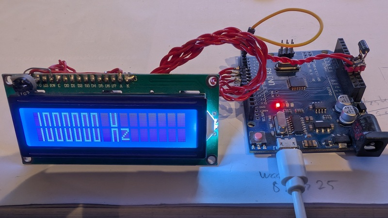

# FrequencyCounter
Counts frequencies up to 8 MHz with a gate time of 1 second

 &nbsp; &nbsp;

 &nbsp; &nbsp;

 &nbsp; &nbsp;

 &nbsp; &nbsp;

 
 

#### If you find this library useful, please give it a star.

&#x1F30E; [Google Translate](https://translate.google.com/translate?sl=en&u=https://github.com/ArminJo/FrequencyCounter)

 

# Principle of operation
Input signal at Pin 4 is directly feed to the **8 bit hardware counter** of timer0. 
An interrupt is generated at every transition of timer0 from 0xFF to 0x00. 
This interrupt maintains a **software counter** for the signal frequency / 256.

**This disables the millis() function, which can be replaced by delayMilliseconds(unsigned int aMillis).**

**Timer 1*** generates an interrupt every second, which reads the 8 bit counter of timer0,
resets it and then adds the value of the software counter to get the frequency.

**Timer2** generates an **1 MHz output** at pin3 by hardware for test and calibration purposes.

Special effort was taken to ensure that the 1 second interrupt is NOT delayed 
and therefore the **gate timing is always exact**. 
To guarantee this, the handling of the transition of timer0 is changed to **polling** 0.5 ms before the 1 second interrupt. 
This allows to use the loop for other purposes the rest of the second :-).

  

# Compile with the Arduino IDE
Download and extract the repository. In the Arduino IDE open the sketch with File -> Open... and select the FrequencyCounter folder.

# Revision History
### Version 1.1
- Big number display.

### Version 1.0
- Initial Version.
